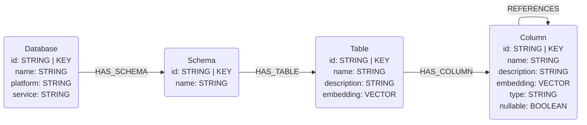
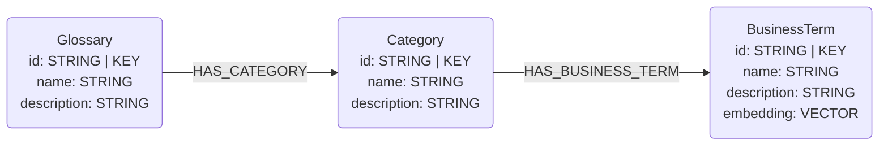

# GCP Dataplex Connector

## Overview

This connector reads information from the GCP Dataplex Universal Catalog via the Python client and maps it to the graph data model schema defined in this library. 

Currently this connector supports reading BigQuery metadata stored in Dataplex and Glossary information.

## Data Model

### BigQuery Metadata

The BigQuery metadata available via Dataplex is not as comprehensive as reading the metadata directly from BigQuery. Below is the supported data model. Notably absent are the primary and foreign key identifiers. Each column is therefore loaded with `isPrimaryKey=False` and `isForeignKey=False`.

### Glossary Information

Dataplex has a Glossary that allows us to store business terms. These terms may then be connected to columns. Below is the data model for Dataplex glossary information.

## Known Issues

